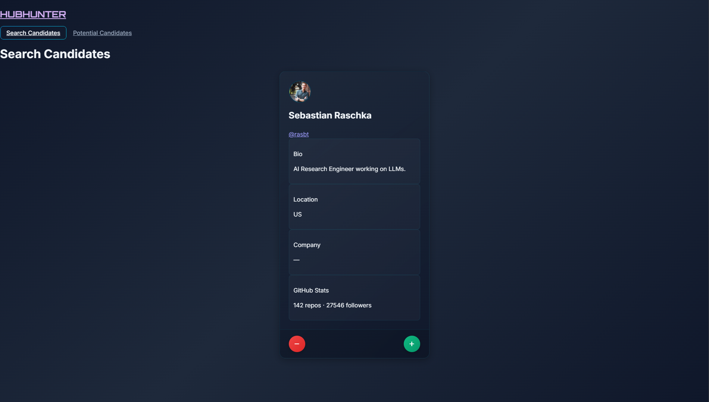

# 🎯 HubHunter

> Find your next star developer with style! ✨

HubHunter is a modern, sleek application that helps tech recruiters and hiring managers discover talented developers on GitHub. With its intuitive interface and smart filtering system, finding your next team member has never been more enjoyable! 

[](https://github.com/KnifeDad)
[](https://hubhunter-of65.onrender.com/)

## 📸 Preview

<div align="center">
  
</div>

## 🚀 Features

- 🔍 Smart developer discovery based on activity and contributions
- 💫 Beautiful, modern UI with smooth animations
- 🎨 Dark theme with gorgeous gradients
- 📊 Quick stats overview for each candidate
- 💾 Save potential candidates for later review
- 🔄 Efficient workflow with accept/reject actions
- 📋 Advanced sorting capabilities for all candidate fields
- 🔎 Smart filtering system to find the perfect match

## 🛠️ Tech Stack

- ⚛️ React + TypeScript
- 🎨 Tailwind CSS
- 🌐 GitHub API Integration
- 🔥 Vite for blazing-fast development

## 🏃‍♂️ Getting Started

1. Clone the repository:
```bash
git clone https://github.com/KnifeDad/hubhunter.git
cd hubhunter
```

2. Install dependencies:
```bash
npm install
```

3. Create a `.env` file in the root directory and add your GitHub token:
```env
VITE_GITHUB_TOKEN=your_github_token_here
```

4. Start the development server:
```bash
npm run dev
```

## 🔑 Environment Variables

| Variable | Description |
|----------|-------------|
| `VITE_GITHUB_TOKEN` | Your GitHub Personal Access Token |

## 🎮 Usage

1. 🏃‍♂️ Launch the application
2. 🔍 Browse through potential candidates
3. ✅ Accept promising developers
4. ❌ Reject those who don't fit
5. 📋 Review your saved candidates
6. 🔄 Sort candidates by any field (click column headers)
7. 🔎 Filter candidates by name, location, company, or bio

## 🎨 UI Features

- 🌙 Modern dark theme
- 🌈 Beautiful gradient effects
- 📱 Responsive design
- 🎭 Smooth transitions
- 🖼️ Clean card layouts
- 📊 Interactive sorting indicators
- 🔍 Real-time filtering

## 📝 License

MIT © [KnifeDad](https://github.com/KnifeDad)

## 🤝 Contributing

Contributions, issues, and feature requests are welcome! Feel free to check the [issues page](https://github.com/KnifeDad/hubhunter/issues).

## 💖 Show your support

Give a ⭐️ if this project helped you!

---

_Built with ❤️ by [KnifeDad](https://github.com/KnifeDad) - Making recruitment fun again!_